# Asset Tools

## Overview

This repository contains tools to analyze, transform, and package asset data into CID-named `.zip` archives for marketplace workflows (for example Envited Marketplace).

The tools are primarily used by the asset service pipeline in:

- <https://github.com/openMSL/sl-5-7-asset-services>

## Supported Formats

- ASAM OpenDRIVE (`.xodr`)
- ASAM OpenSCENARIO XML (`.xosc`)
- 3D environment model archives (`.zip`, `.7z`) with a companion `statistic_3dModel.json` metadata file in the same input folder

## What Happens When You Process an Asset

The pipeline transforms a raw simulation file into a packaged, described, and validated asset archive.
Each step is handled by a dedicated module:

| # | Phase | Module | What it does |
|---|-------|--------|--------------|
| 1 | 📄 Extract | [metadata_extractor](metadata_extractor/README.md) | Parse the asset file and pull out raw metadata attributes |
| 2 | 🔗 Describe | [jsonld_creator](jsonld_creator/README.md) | Turn attributes into linked-data (JSON-LD) using SHACL ontologies |
| 3 | 🔗 Describe | [openlabel_creator](openlabel_creator/README.md) | Transform OpenLABEL scenario tags into JSON-LD (xosc only) |
| 4 | 🧩 Shape | [shacl_combiner](shacl_combiner/README.md) | Bundle all referenced SHACL shapes into one validation file |
| 5 | ✨ Enrich | [metadata_enricher](metadata_enricher/README.md) | Fill empty metadata fields using rules (disabled by default) |
| 6 | ✨ Enrich | [wizard](wizard/README.md) | Interactive SHACL-driven wizard for manual metadata entry |
| 7 | ✅ Validate | OMB validation suite | Check metadata conforms to ontology constraints |
| 8 | 🔍 Check | [quality_checker](quality_checker/README.md) | Run ASAM/OpenMSL standard compliance checkers |
| 9 | 🗺️ Preview | [geojson_creator](geojson_creator/README.md) | Generate GeoJSON road network + bounding box |
| 10 | 🗺️ Preview | [preview_3d](preview_3d/README.md) | Create 3D lane-level GeoJSON preview (disabled by default) |
| 11 | 📇 Index | [search_indexer](search_indexer/README.md) | Build compact binary JSON for search/filtering |
| 12 | 📦 Package | [packager](packager/README.md) | Assemble final folder structure, manifest, and asset.zip |

The [pipeline](pipeline/README.md) module orchestrates all steps based on [`configs/process.json`](configs/process.json).

## Standalone Utilities

- [utils](utils/README.md): Shared helper modules (logging, subprocess, JSON/RDF I/O, geometry).
- [xodr_calc_box](xodr_calc_box/README.md): Bounding box calculation for OpenDRIVE files.
- [xodr_trim_to_box](xodr_trim_to_box/README.md): Trim OpenDRIVE files to a geographic bounding box.
- [ontology_generator](ontology_generator/README.md): Generate OWL ontologies + SHACL shapes from Excel tables.

## Process Diagram

```mermaid
flowchart TD
    input["input_manifest.json<br/><i>.xodr / .xosc / .zip,.7z</i>"]

    subgraph extract ["📄 Extract"]
        mde["metadata_extractor<br/><small>xodr, xosc</small>"]
        mde_val["syntax validator<br/><small>(OMB)</small>"]
        mde3d["3dmodel metadata extractor<br/><small>3dmodel</small>"]
    end

    subgraph describe ["🔗 Describe"]
        jlc["jsonld_creator<br/><small>xodr, xosc</small>"]
        olc["openlabel_creator<br/><small>xosc</small>"]
        jlc3d["3dmodel jsonld_creator<br/><small>3dmodel</small>"]
    end

    sc["🧩 shacl_combiner"]

    subgraph enrich ["✨ Enrich"]
        llm["metadata_enricher ⚠️<br/><small>disabled by default</small>"]
        wiz["wizard<br/><small>interactive or copy</small>"]
    end

    val1["✅ jsonld_validator<br/><small>(OMB)</small>"]

    subgraph quality ["🔍 Quality Check"]
        qc_asam_xodr["quality_checker ASAM<br/><small>xodr</small>"]
        qc_asam_xosc["quality_checker ASAM<br/><small>xosc</small>"]
        qc_omsl["quality_checker OpenMSL<br/><small>xodr</small>"]
    end

    subgraph preview ["🗺️ Preview"]
        route["geojson_creator<br/><small>roadNetwork + bbox</small>"]
        p3d["preview_3d ⚠️<br/><small>3D lanes · disabled by default</small>"]
    end

    reducer["📇 search_indexer<br/><small>XML → .bjson</small>"]

    subgraph finalize ["📦 Package"]
        struct["packager<br/><small>folder layout + manifest input</small>"]
        struct_val["syntax validator<br/><small>(OMB)</small>"]
        manifest_jlc["jsonld_creator<br/><small>manifest.json</small>"]
        manifest_val["jsonld_validator<br/><small>(OMB)</small>"]
    end

    archive["asset.zip 📦"]

    input --> extract
    extract --> describe
    describe --> sc --> enrich --> val1
    val1 --> quality --> preview --> reducer
    reducer --> finalize --> archive

    wizard_ui(["SD Creation Wizard 🌐<br/><small>browser UI · optional</small>"])
    wiz -. "WIZARD=true" .-> wizard_ui

    style llm fill:#fff3cd,stroke:#ffc107
    style p3d fill:#fff3cd,stroke:#ffc107
    style wizard_ui fill:#e8f4f8,stroke:#17a2b8
    style archive fill:#d4edda,stroke:#28a745
    style input fill:#e2e3e5,stroke:#6c757d
```



## Configuration

Pipeline behavior is configured through files in [`configs/`](configs).

There are two configuration types:

1. `process.json`

- Defines module order and activation flags.
- Each item contains:
  - `enable`: activate/deactivate module
  - `filename`: module config filename
  - `extensions`: supported asset extensions

1. Module-specific config (for example `config_metadata_extractor.json`)

- Defines concrete call parameters for a module.
- Core fields:
  - `name`
  - `environment type`
  - `data folder`
  - `params` (`call`, `input`, `output`, `additional`)

Supported placeholders:

- `path`: output base directory
- `sub_path`: target data subfolder
- `name`: asset filename stem
- `asset_path`: directory containing the input manifest
- `asset_type`: asset domain type (`hdmap`, `scenario`, `environment-model`)

Example:

```json
{
  "name": "geojson_creator",
  "environment type": "python",
  "data folder": "media",
  "params": {
    "call": "geojson_creator.main",
    "output": {
      "-out": "{path}/{sub_path}/roadNetwork.geojson"
    },
    "additional": {
      "-box": "{path}/{sub_path}/bbox.geojson"
    }
  }
}
```

## Build

Python 3.12+ is required.

```bash
git clone https://github.com/openMSL/sl-5-8-asset-tools.git
cd sl-5-8-asset-tools
make setup
```

All dependencies are managed via `pyproject.toml` and installed automatically by `make setup`.
When run from a git checkout, `make setup` also initializes and updates the configured git submodules automatically. Cloning with `--recurse-submodules` still works, but is no longer required.

On Windows, run `make` from Git Bash or another POSIX `sh`-compatible shell.

Run `make help` for the full list of available commands.

## Usage

### Run Example Pipelines

Two ready-to-run examples are included under `examples/`:

```bash
make generate opendrive      # OpenDRIVE example  → examples/assets/
make generate openscenario   # OpenSCENARIO example → examples/assets/
```

### Batch Processing

Process all input manifests under the `examples/` directory tree in a single
command.  HD-map inputs are processed before scenarios so cross-references
resolve correctly:

```bash
make generate batch
```

### Selective Module Execution

Individual pipeline modules can be enabled or disabled at runtime using the
`PIPELINE_FLAGS` variable:

```bash
# Skip a specific module
make generate opendrive PIPELINE_FLAGS="-disable geojson_creator"

# Run only specific modules (whitelist)
make generate opendrive PIPELINE_FLAGS="-enable metadata_extractor packager"

# Enable 3D preview generation (disabled by default)
make generate opendrive PIPELINE_FLAGS="-enable preview_3d"

# List available module IDs
make generate opendrive PIPELINE_FLAGS="-list-modules"
```

When calling the pipeline directly:

```bash
python -m pipeline.main input.json -config configs -out ./out -disable preview_3d
python -m pipeline.main -config configs -list-modules
```

### Run Pipeline for a Custom Input Directory

```bash
make generate INPUT_DIR=path/to/input
```

`OUTPUT_DIR` defaults to `examples/assets/`.
Override explicitly if needed:

```bash
make generate INPUT_DIR=path/to/input OUTPUT_DIR=/tmp/my-output
```

The `INPUT_DIR` must contain an `input_manifest.json`. This is the mode used by downstream asset repositories (e.g. `hd-map-asset-example`) to delegate pipeline execution.

Each input example follows this convention:

- `examples/<source>/<name>/<type>/` — input manifest, simulation data, media, docs, LICENSE
- `examples/assets/` — pipeline-generated EVES-003 assets (gitignored)

By default the pipeline uses concise, stage-oriented logging. To inspect raw
child command lines and full stdout/stderr, set `SL58_LOG_MODE=debug` before
running `make generate ...`.

PowerShell example:

```powershell
$env:SL58_LOG_MODE = "debug"
make generate opendrive
```

## Input Manifest

### Generating a Manifest Automatically

If you don't have an `input_manifest.json` yet, generate one from your files:

```bash
make init INPUT_DIR=path/to/my-asset
```

This scans the directory for simulation data (`.xodr`, `.xosc`, `.zip`, `.7z`),
documentation, media, and license files, then writes an `input_manifest.json`
ready for the pipeline.  Review and edit the generated file if needed, then run:

```bash
make generate INPUT_DIR=path/to/my-asset
```

Use `FORCE=true` to overwrite an existing manifest.

### Manifest Format

The pipeline accepts an `input_manifest.json` (JSON-LD) that describes the asset
files, their categories and access roles.

Minimal `input_manifest.json` example:

```json
{
  "@context": [
    "https://w3id.org/ascs-ev/envited-x/manifest/v5/",
    { "envited-x": "https://w3id.org/ascs-ev/envited-x/envited-x/v3/" }
  ],
  "@id": "did:key:z6Mk...",
  "@type": "envited-x:Manifest",
  "hasArtifacts": [
    {
      "@type": "Link",
      "hasCategory": { "@id": "envited-x:isSimulationData" },
      "hasAccessRole": { "@id": "envited-x:isOwner" },
      "hasFileMetadata": {
        "@type": "FileMetadata",
        "filePath": "my-road.xodr",
        "mimeType": "application/xml"
      }
    }
  ],
  "hasLicense": {
    "@type": "Link",
    "hasCategory": { "@id": "envited-x:isLicense" },
    "hasAccessRole": { "@id": "envited-x:isPublic" },
    "hasFileMetadata": {
      "@type": "FileMetadata",
      "filePath": "LICENSE",
      "mimeType": "text/plain"
    }
  }
}
```

Supported categories:

- `isSimulationData`, `isDocumentation`, `isMedia`, `isMetadata`
- `isValidationReport`, `isLicense`, `isMiscellaneous`

## SD Creation Wizard

The SD Creation Wizard provides a browser-based UI for interactive metadata
enrichment. It parses SHACL ontology shapes into dynamic forms, pre-fills them
with auto-extracted values, and lets users complete any missing fields before
the pipeline continues.

### Prerequisites

- Node.js 20+ and pnpm (installed automatically via corepack)
- Installed automatically by `make setup` (if Node.js is available)

### Interactive Pipeline Usage (Recommended)

The simplest way to use the wizard — just add `WIZARD=true`:

```bash
WIZARD=true make generate INPUT_DIR=examples/ika/SCEN-95B774BAC0A9/hdmap
```

This runs the full pipeline and at the wizard step:

1. Auto-starts the wizard API + frontend (if not already running)
2. Opens your browser with a form pre-filled from extracted metadata
3. Pauses the pipeline until you click **Export**
4. Writes the enriched metadata and continues the pipeline

No separate `make wizard` step needed — everything is automatic.

### Manual Server Management

```bash
make wizard            # start the wizard API + frontend manually
make wizard stop       # stop the wizard servers
make setup wizard      # reinstall wizard dependencies
```

### CLI Mode (Non-Interactive)

Without `WIZARD=true`, the wizard step simply copies JSON-LD unchanged
(disabled by default in config). For terminal-based prompts:

```bash
python -m wizard.main metadata/hdmap.json -shacl temp/hdmap.ttl -enable true -out metadata/hdmap.json
```

### Architecture

| Service  | URL                    | Purpose |
|----------|------------------------|---------|
| API      | <http://localhost:3007> | SHACL parsing, session management |
| Frontend | <http://localhost:5174> | React wizard UI |

Ports are configurable via `.env` (see `.env.example`):

```env
WIZARD_API_PORT=3007
WIZARD_FRONTEND_PORT=5174
```

## Metadata Review

Review existing generated assets interactively.  `make review` runs two phases:

1. **Enrichment** — `metadata_enricher` fills empty metadata fields using rule-based inference and records provenance (method + confidence) in `*_provenance.json` files.
2. **Wizard review** — Enriched assets are queued in the SD Creation Wizard for human verification. The wizard pre-fills forms from the existing JSON-LD and highlights inferred values.

Re-zips any assets whose metadata changed after review:

```bash
make review                            # review all assets in examples/assets/
make review REVIEW_DIR=path/to/assets  # review assets in a custom directory
```

### How It Differs from Validate

| Command | Purpose | Automated | Modifies assets |
|---------|---------|-----------|-----------------|
| `make validate` | SHACL schema conformance check | Yes (read-only) | No |
| `make review` | Human metadata review via wizard | Interactive | Yes (re-zips on change) |

Use `validate` to verify structural correctness.  Use `review` to verify
semantic completeness and accuracy with a human in the loop.

## Notes

- For module-specific usage and parameters, see each module README linked above.
