# Asset Tools

Tools to analyze, transform, and package simulation asset data into
EVES-003 conformant `asset.zip` archives for the
[ENVITED-X Dataspace](https://2getthere.2gether.eu).

The tools are primarily used by the asset service pipeline in
[sl-5-7-asset-services](https://github.com/openMSL/sl-5-7-asset-services).

## Supported Formats

| Format | Extension | Asset Type |
|--------|-----------|------------|
| ASAM OpenDRIVE | `.xodr` | `hdmap` |
| ASAM OpenSCENARIO XML | `.xosc` | `scenario` |
| 3D environment model | `.zip`, `.7z` | `environment-model` |

## Quick Links

- [Setup](getting-started/setup.md) — install and configure the toolchain
- [Quick Start](getting-started/quickstart.md) — generate your first asset
- [Pipeline Modules](modules/index.md) — module reference
- [Input Manifest](reference/input-manifest.md) — manifest format specification
- [Configuration](reference/configuration.md) — pipeline configuration
- [Contributing](contributing.md) — code style, DCO, development workflow

## Process Diagram

```mermaid
flowchart TD
    input["input_manifest.json<br/><i>.xodr / .xosc / .zip,.7z</i>"]

    subgraph extract ["Metadata Extraction"]
        mde["meta_data_extractor<br/><small>xodr, xosc</small>"]
        mde_val["extractor JSON syntax validator<br/><small>(OMB)</small>"]
        mde3d["3dmodel_meta_data_extractor<br/><small>3dmodel</small>"]
    end

    subgraph jsonld ["JSON-LD Creation"]
        jlc["jsonLD_creator<br/><small>xodr, xosc</small>"]
        olc["openlabel_creator<br/><small>xosc</small>"]
        jlc3d["3dmodel_jsonLD_creator<br/><small>3dmodel</small>"]
    end

    sc["shacl_combiner"]

    subgraph enrich ["Metadata Enrichment"]
        llm["llm_enricher ⚠️<br/><small>disabled by default</small>"]
        wiz["wizard_caller<br/><small>interactive or copy</small>"]
    end

    val1["jsonLD_validator<br/><small>(OMB)</small>"]

    subgraph quality ["Quality Checks"]
        qc_asam_xodr["qualitychecker ASAM<br/><small>xodr</small>"]
        qc_asam_xosc["qualitychecker ASAM<br/><small>xosc</small>"]
        qc_omsl["qualitychecker OpenMSL<br/><small>xodr</small>"]
    end

    subgraph geo ["Geospatial"]
        route["xodr_routing_creator<br/><small>roadNetwork + bbox GeoJSON</small>"]
        preview["xodr_to_geojson_caller ⚠️<br/><small>3D preview · disabled by default</small>"]
    end

    reducer["asset_reducer<br/><small>XML → .bjson</small>"]

    subgraph finalize ["Finalize"]
        struct["structure_creator<br/><small>folder layout + manifest input</small>"]
        struct_val["structure JSON syntax validator<br/><small>(OMB)</small>"]
        manifest_jlc["jsonLD_creator<br/><small>manifest.json</small>"]
        manifest_val["jsonLD_validator<br/><small>(OMB)</small>"]
    end

    archive["asset.zip 📦"]

    input --> extract
    extract --> jsonld
    jsonld --> sc --> enrich --> val1
    val1 --> quality --> geo --> reducer
    reducer --> finalize --> archive

    wizard(["SD Creation Wizard 🌐<br/><small>browser UI · optional</small>"])
    wiz -. "WIZARD=true" .-> wizard

    style llm fill:#fff3cd,stroke:#ffc107
    style preview fill:#fff3cd,stroke:#ffc107
    style wizard fill:#e8f4f8,stroke:#17a2b8
    style archive fill:#d4edda,stroke:#28a745
    style input fill:#e2e3e5,stroke:#6c757d
```

